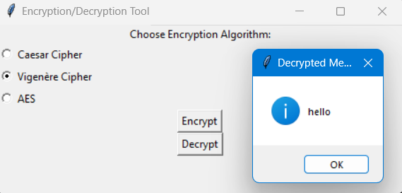

# Encryption/Decryption Tool

This is a simple GUI-based encryption/decryption tool that supports three encryption algorithms: Caesar Cipher, Vigenère Cipher, and AES. The tool is built using Python's Tkinter library for the GUI and the PyCryptodome library for AES encryption.

## Features

- **Caesar Cipher**: 
  - Simple substitution cipher.
  - Shifts each letter by a specified number of places in the alphabet.
  - Supports both encryption and decryption.
  - 
  - 
  - 
  - 

- **Vigenère Cipher**:
  - Polyalphabetic substitution cipher.
  - Uses a keyword to shift letters in the plaintext.
  - Supports both encryption and decryption.
  - 
  - 
  - 
  - 

- **AES (Advanced Encryption Standard)**:
  - Symmetric encryption algorithm.
  - Uses a random 128-bit key for encryption.
  - Encrypts and decrypts data securely.
  - 
  - 
  - 
  - 

## Screenshots

- **Home Screen**
  - 
